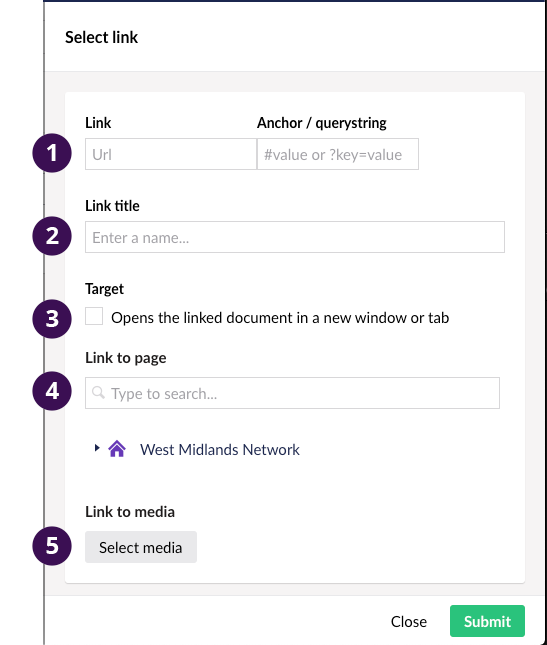
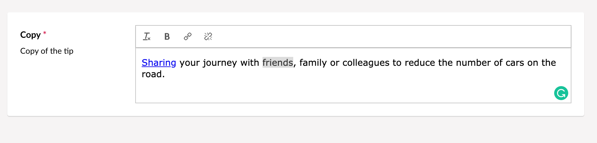
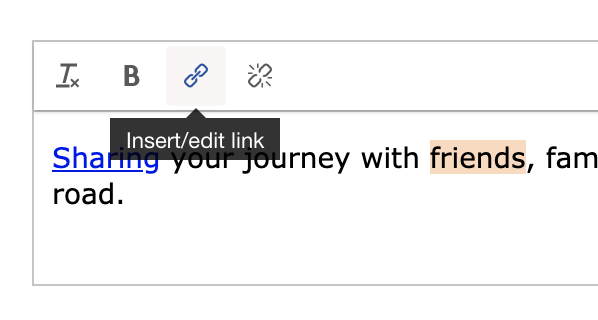
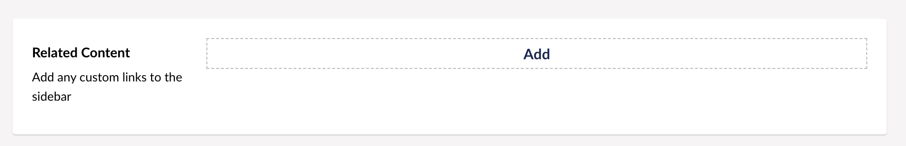

# Adding Links

To add or edit a link the CMS has a standard component but there's multiple way of adding depending on the page you're editing.

## The Link Component

1. Add a custom link. This is usualy used for external links.
2. Enter a link title for accessibility. This will appear when a user hovers over the link or uses screen reader software.
3. Target - If the link is going to an external website it's best practice to open it in a new window/tab.
4. Use this section to link to an internal page. the link and title will be automatially populated.
5. Use this button to link to media in the CMS Media library.

## Methods of adding links

### 1 - Rich text Editor

The Rich Text Editor is an editable block with similer functions to a text editor. On some of the website page you're able to add and edit inline links.

1. Hightlight the text you want linking

2. Click on the link icon in the toolbar
Note - This icon is not available on all Rich Text Editors

### 2 - CMS Link Component

Click on the "Add" button

