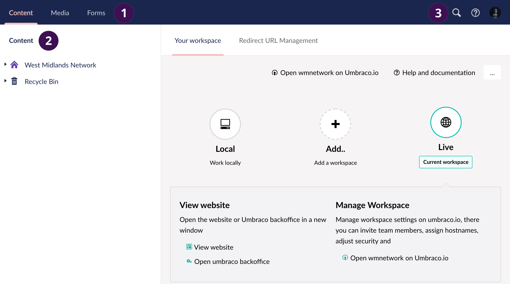

# Umbraco Interface

## Initial View

After logging in to WMN Umbraco you will be presented with a dashboard containing a wide array of buttons and features. In this guide you will gain a quick overview of what each button does.

## 1 - The Sections menu

- The first button is Content this is where you manage your content.
- The next button is Media, under this tab you can manage images and other media files.
- The next button is Forms, under this tab you can manage online forms.

## 2 - The Section tree

The section tree will be different depending on what section you are on. The section will allow you an overview of the nodes that is contained in the tree. In the this case you are looking at the content section. The first field is Content this allows you to create content nodes, and manage your content tree. When you hover over the sections, it will highlight with a darker color indicating that you are hovering over it. A button with three dots will show up, clicking this will present you with additional options. There will be other option if you right click the field. The Recycle bin, this is where your deleted content ends up. This will be on the Content section and the media section only.

## 3 - Search and help

The first button is a search field where you can search for the content, that you are looking for. The second button is the help button if you click this you will get options for help. The third button is your profile, this will give you the option to edit your profile and password.
