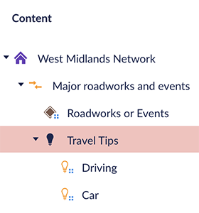
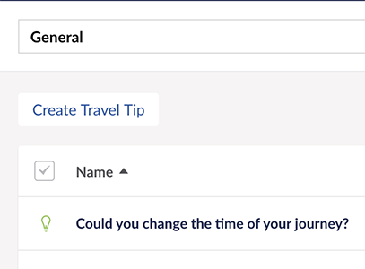
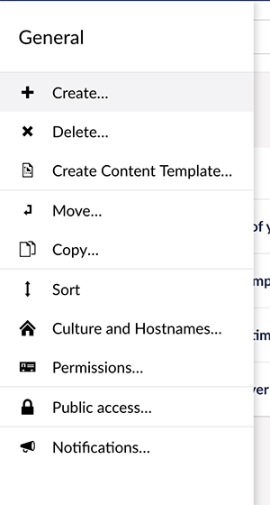
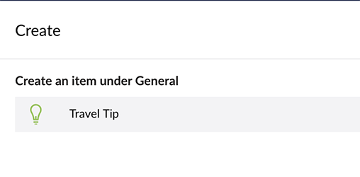
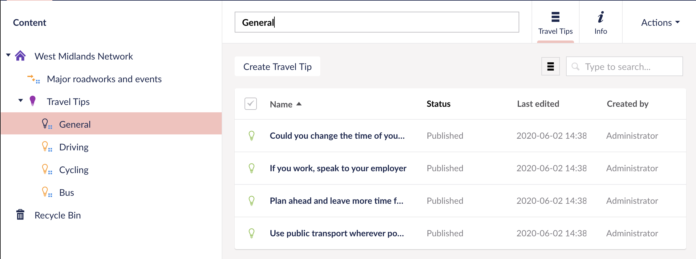
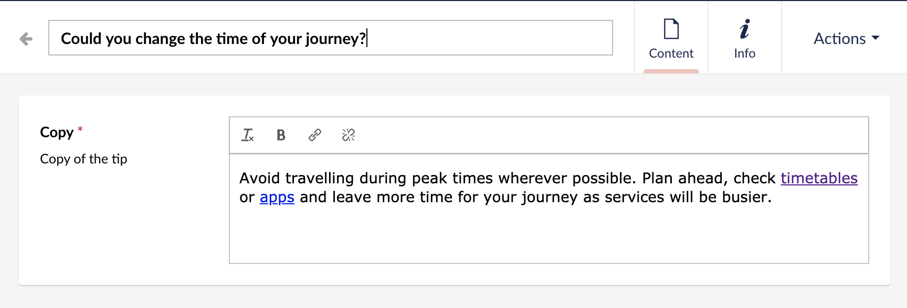

# Travel Tips

Add travel tips to be used on the Major Roadworks & Events pages

```
Navigate to this content location: West Midlands Network > Travel Tips
```



Travel Tips are split up into categories. You can add a new category by creating a new page. 

[See Documentation on adding new pages](/cms/create-save-publish "Create a new page").

## Adding Tips

1. Select a category you want to add a tip to
2. Create a new page by:
 - Clicking on the button "Create Travel Tip"


 - Creating a new page by right clicking on the category and clicking on "Create..."



Then click on "Travel Tip"




## Editing Tips

Find the tip you want to edit by browsing to it in the content tree or by [searching for it](/cms/search "Search for a page").



Edit the content in the "Copy" box.


