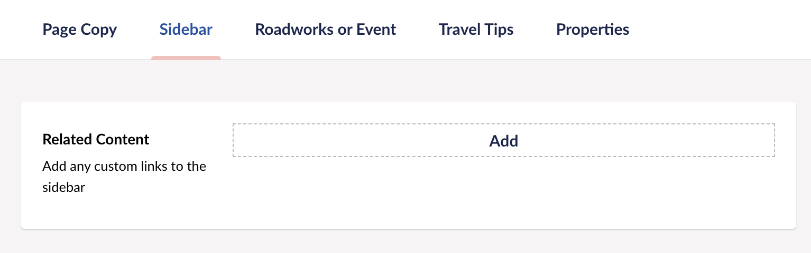

# Add or Edit a main event page

Each roadwork or event needs to be manually added to the cms. 

```
Navigate to this content location: West Midlands Network > Major roadworks and events
```


On the top right of the cms select the "Event Pages" tab. This will show a list of all roadworks and events.


Here you can edit an existing event or create a new one. 

## Add an event

### Create

Create a new event by clicking on the "Create Roadworks or Event Hub" button.


#### * Required details

The first required fields can be found on the "Page Copy" tab.

- Page name. This is the name of the roadwork or event.


- What's happening copy. This is the main summary of the roadwork or event. This summary will also appear on any sub pages of the event.


The following required fields can be found on the "Roadworks or Event" tab.

- location. Select the location of the event from the dropdown list.
- Start date / time. Select the start date and time of the event.


### Optional Details

- Image. This image will appear on the top right of the event and will be used in any sub pages.


- Copy. Any extra copy can be added here.


- Related content




- End date / time + Ongoing. In order for the event to appear in the major work list you need to either add an end date or select that it's an ongoing event. 


- Travel Tips.

You can select which travel tips to display. You can choose not to show any by not adding any. [Follow the Travel Tips documentation](/major-roadworks-and-events/add-travel-tips "Add or edit Travel Tips").

## Edit an event

[Follow the Edit Content documentation](/cms/edit-content "Edit Content").