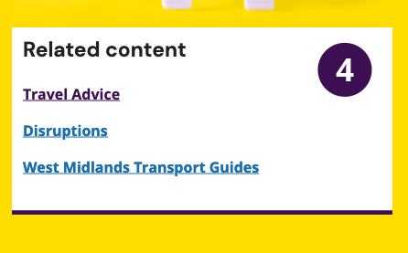
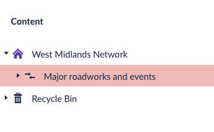
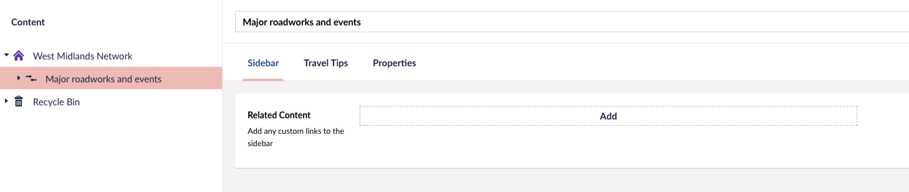
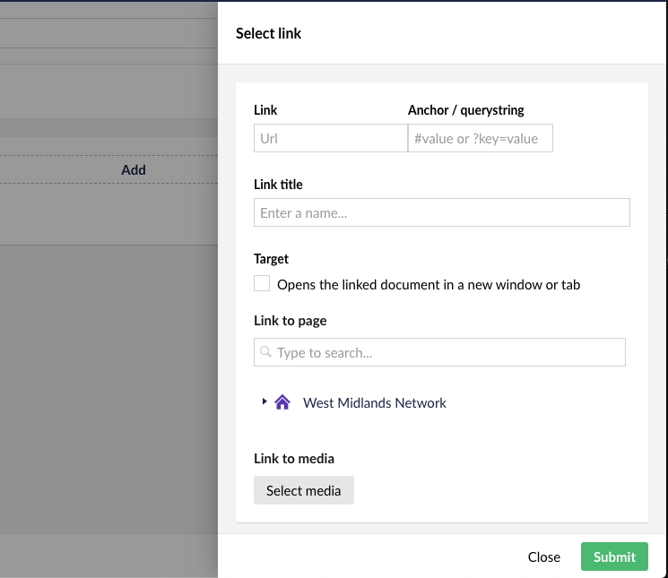
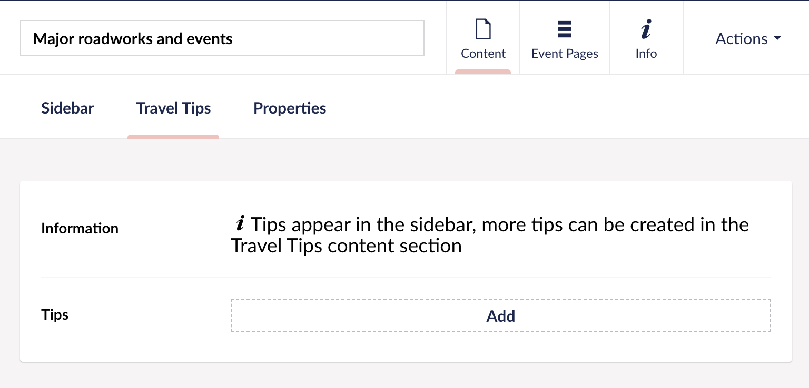
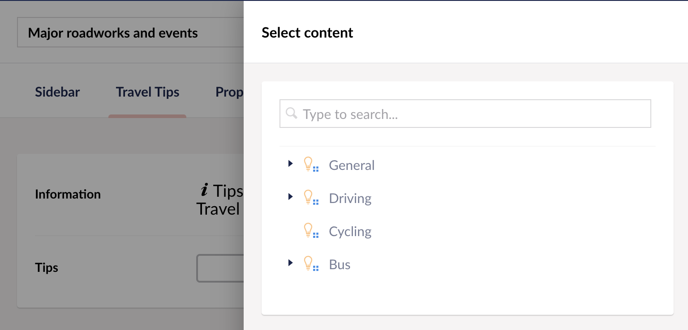
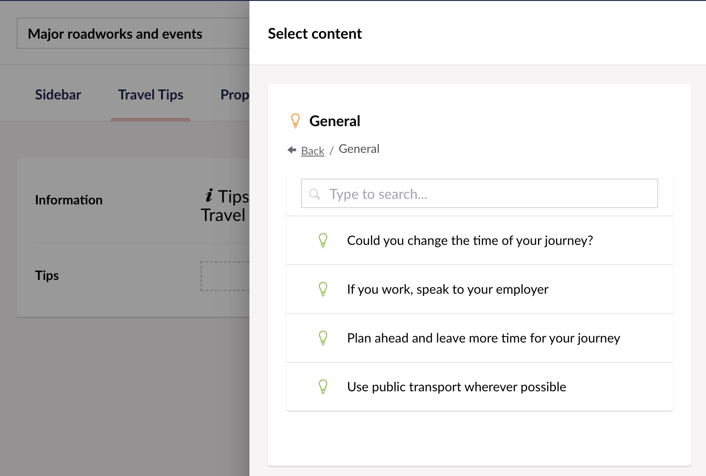

# Edit the hub page

Documentation for editing the [main hub page](https://beta.wmnetwork.co.uk/major-roadworks-and-events/ "Major roadworks and events").

On this page the following can be edited or added:

1. Related content
2. Add Travel tips

## Add Related Content Links 

1. Open the hub page in Umbraco:

West Midlands Network > Major roadworks and events

2. Open the hub page in Umbraco:

Make sure you have the "Sidebar" tab selected

3. Add Links

You can add related links by clicking on the "Add" button. There is no limit to the amount you can add.

See documentation on [adding links](/cms/adding-links/ "Link Documentation").

## Add Travel Tips

You can select which travel tips to display but in order to add or edit them [follow the Travel Tips documentation](/major-roadworks-and-events/add-travel-tips "Add or edit Travel Tips").

1. On the Major roadworks and events page click on the "Travel Tips" tab.

2. Click on the "Add" button which will reveal an overlay.

3. Select the category by clicking on the triangle to the left of the category title.

4. Select the travel tips oyu want displayed

Tip: You can select tips from another category by clicking on the back link and then selecting a category.

Theres a maximum of 10 tips that you can add.
